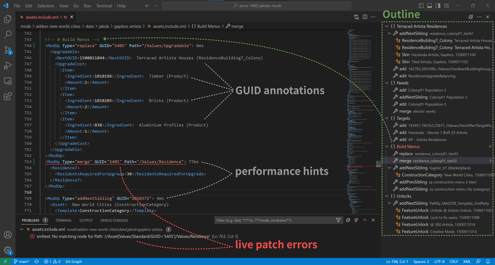

# Syntax and Error Checking

??? info "Requires game path configuration."
    --8<-- "snippets/game-path-required.md"

## GUID Annotation

Displays name and template name of GUIDs.

This feature will also consider Mod GUIDs, if they are either:
- part of your own mod
- part of a dependency mentioned in `modinfo.json` and installed into the game's `mods/` folder

## Live Analysis

The live analysis applies your mod on save to the game and provides error and performance information.

## Syntax Check

The plugin will scan you asset files for common problems like the use of outdated pools (e.g. `190611`).
The file must match the naming scheme `assets*.xml` to be considered.

## Show Diff

The diff view shows affected assets before and after patching.

There are multiple ways to open the diff view:

- ModOps (selection): Right-click inside a `ModOp`, or a selection text spanning multiple ModOps, then choose `Anno: Show Diff (Selection)`
- Single file: Right-click a patch file (`assets.xml`, `templates.xml` or `*.include.xml`, `export.bin.xml`) and choose `Anno: Show Diff`
- All assets: Right-click on the `modinfo.json` and choose `Anno: Show Diff (Assets)`

??? tip "Press ++ctrl++ + ++shift++ + ++o++ to navigate between assets quickly."
    This opens the editor's symbol picker (a dropdown listing all assets by name).

??? info "`LoadAfter` and development dependencies are applied before the diff."
    The diff is computed **after** applying:

    - any development dependencies (`Development.Dependencies`), and
    - any dependency that appears in both `Dependencies.Require` and `Dependencies.LoadAfter`.

    See: [Dependencies](https://jakobharder.github.io/anno-mod-loader/modinfo/#dependencies) and [Development Info](https://jakobharder.github.io/anno-mod-loader/modinfo/#development-info).
