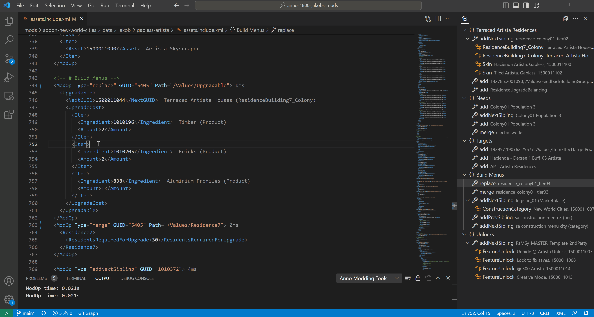

# Syntax and Error Checking

## GUID Annotation

Displays name and template name of GUIDs.

This feature will also consider Mod GUIDs, if they are either:
- part of your own mod
- part of a dependency mentioned in `modinfo.json` and installed into the game's `mods/` folder

## Live Analysis

The live analysis applies your mod on save to the game and provides error and performance information.

## Syntax Check

The plugin will scan you asset files for common problems like the use of outdated pools (e.g. `190611`).
The file must match the naming scheme `assets*.xml` to be considered.

## Show Diff

You can check th results of one or more `ModOp`s by selecting them and then right click > `Anno: Compare Results with Vanilla`.

Alternatively, you can compare full files and mods by right clicking on `assets.xml`, `templates.xml` and `*.include.xml`.
