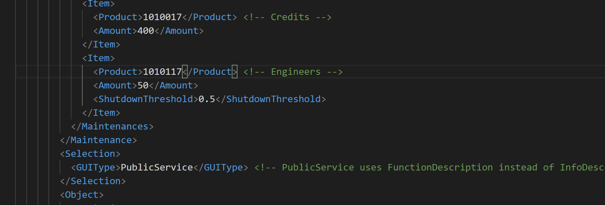

# Auto Complete

??? info "Requires game path configuration."
    --8<-- "snippets/game-path-required.md"

## GUID Conversion

You get a list of possible GUID matches to replace to.
The list is shown automatically in XML tags that expect a GUID, or after typing `GUID="` in ModOps.

Otherwise, trigger the list manually with `Ctrl` + `Space`.

Not all GUIDs can be converted automatically due to performance. Most notable exclusions are `Test` and `Audio`.

## Auto Completion

Now your code gets validated and you can press `Ctrl` + `Space` anywhere in the document and get a list of possible tags, enums or GUIDs.

!!! note "If you want to force updates for auto-completion delete `C:\Users\<user>\.lemminx` and re-open VSCode."
