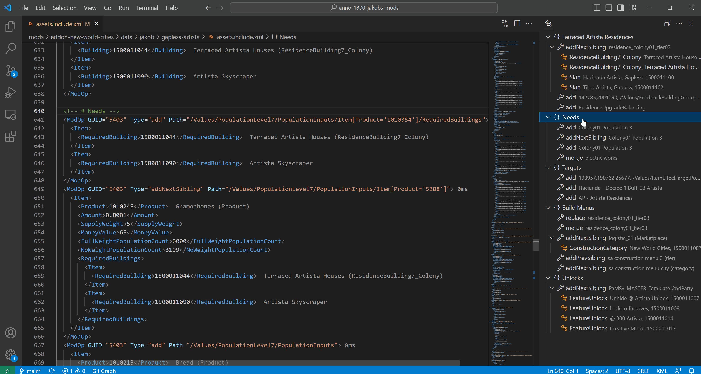

# Navigation



## Jump to Asset

Right click on any GUID and select `Go to Definition` or press ++f12++ to jump to the related mod or vanilla asset.

The plugin searches in the following locations for assets:

<div class="annotate" markdown>
- Vanilla assets (1)
- Current mod
- Dependencies found in the workspace or in the mods folder (2)
- Any XML patch opened once during current session
</div>

1.  Requires game path configuration.

    --8<-- "snippets/game-path-required.md"

2.  Requires mods folder configuration.

    --8<-- "snippets/mods-folder-required.md"

!!! tip "Press ++ctrl++ + ++t++ to search and quickly jump to an asset."

## Outline

{ width="300" align="right" }

The plugin has custom outlines for ModOp patches and CFG & IFO files.

Clicking on an outline entry navigates the cursor to the according position in the document.

!!! tip "Open Outline"
    Press ++ctrl++ +  ++alt++ + ++b++ and go to the tab `Outline`.

    Or alternatively, ++ctrl++ + ++shift++ + ++o++ to just jump to a section.

<div style="clear: both;"></div>

### Naming Sections

=== "Code"
    ```xml
    <ModOps>
      <!-- # Section 1 -->
      <Group />
      <ModOp Type="Add"/>

      <!-- # Section 2 -->
      <ModOp Type="Remove"/>
    </ModOps>
    ```
=== "Result"
    { width="500" }

### Naming Groups

=== "Code"
    ```xml
    <ModOps>
      <Group />

      <!-- This group has a name -->
      <Group />
    </ModOp>
    ```
=== "Result"
    { width="500" }