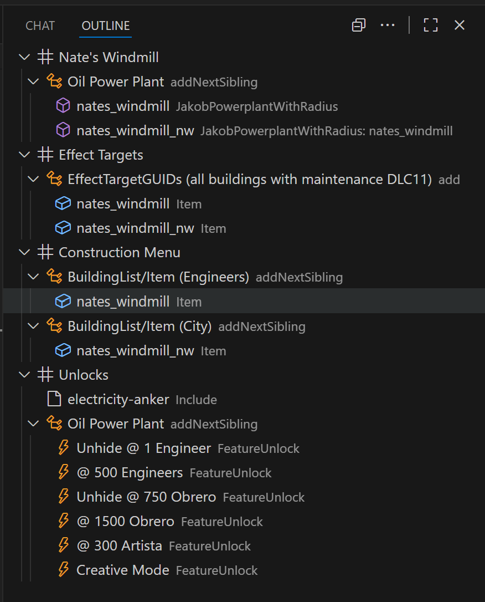
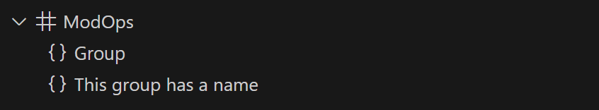

# Outline

{ width="300" align="right" }

The plugin has custom outlines for ModOp patches and CFG & IFO files.

Clicking on an outline entry navigates the cursor to the according position in the document.

!!! tip "Open Outline in VSCode"
    Hit ++ctrl++ +  ++alt++ + ++b++ and go to the tab `Outline`.

    Or alternatively, ++ctrl++ + ++shift++ + ++o++ to just jump to a section.

<div style="clear: both;"></div>

## Naming Sections

=== "Code"
    ```xml
    <ModOps>
      <!-- # Section 1 -->
      <Group />
      <ModOp Type="Add"/>

      <!-- # Section 2 -->
      <ModOp Type="Remove"/>
    </ModOps>
    ```
=== "Result"
    { width="500" }

## Naming Groups

=== "Code"
    ```xml
    <ModOps>
      <Group />

      <!-- This group has a name -->
      <Group />
    </ModOp>
    ```
=== "Result"
    { width="500" }